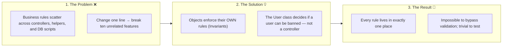
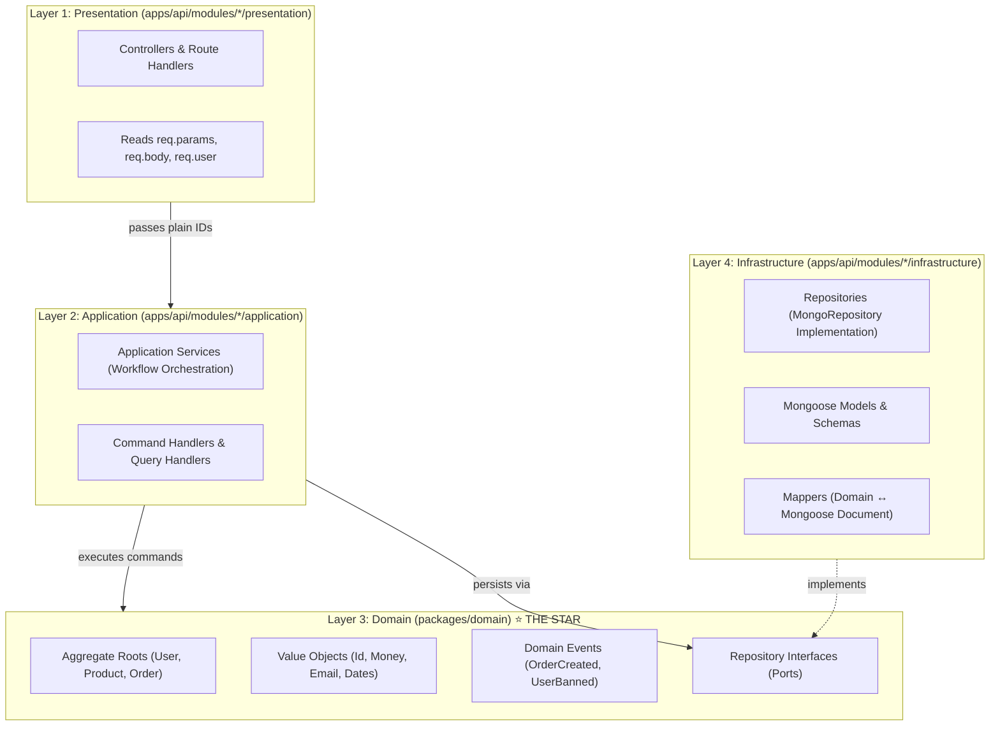
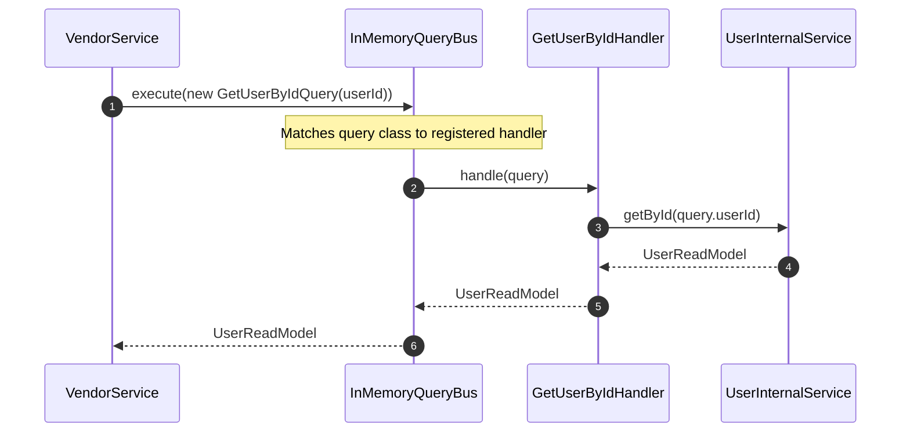
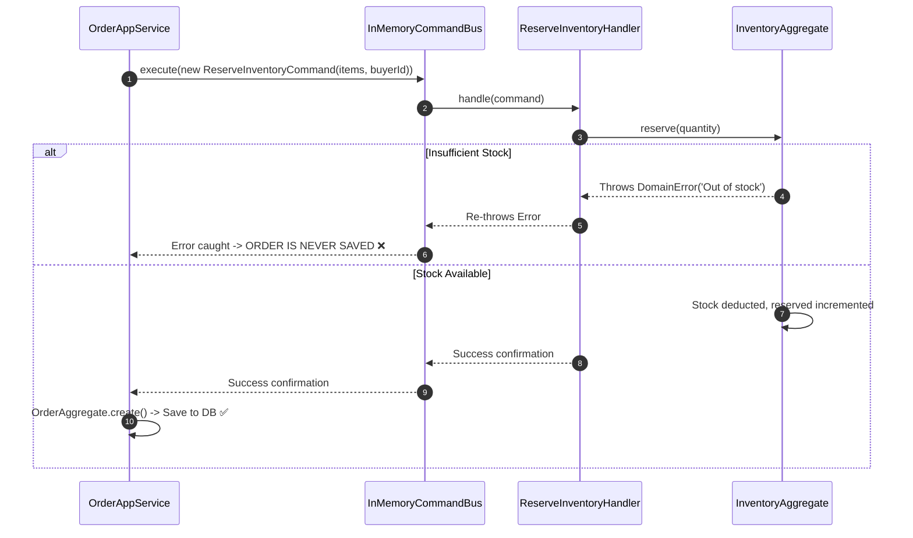
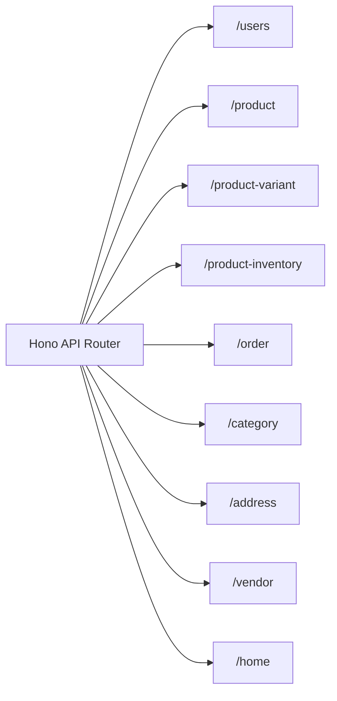

# E-Commerce Monorepo — Comprehensive Architecture & DDD Engineering Guide

Welcome to the definitive architecture and operational documentation for the **E-Commerce Monorepo**. This system is an enterprise-grade, multi-platform e-commerce solution engineered with **Domain-Driven Design (DDD)**, **Clean Architecture / Hexagonal Architecture (Ports & Adapters)**, and **Command-Query Responsibility Segregation (CQRS)**.

This manual unifies the active codebase implementation with the core architectural philosophy and visual mental models established in the system's foundational notes (`Ifra.html`).

---

## Table of Contents

1. [DDD in 2 Minutes — The Core Philosophy](#1-ddd-in-2-minutes--the-core-philosophy)
   - [The Three Core Ideas](#the-three-core-ideas)
   - [The Vending Machine Analogy](#the-vending-machine-analogy)
   - [The Golden Rule of Invariants](#the-golden-rule-of-invariants)
2. [The 4 Layers of Architecture](#2-the-4-layers-of-architecture)
   - [The Restaurant Analogy (Waiter, Manager, Chef, Equipment)](#the-restaurant-analogy)
   - [The 4 Layers Visualized](#the-4-layers-visualized)
   - [The Iron Law of Dependencies](#the-iron-law-of-dependencies)
   - [Implementation Order: Foundation Up (Steps 1–17)](#implementation-order-foundation-up-steps-117)
3. [The Domain Fortress: Aggregates, Value Objects & Events](#3-the-domain-fortress-aggregates-value-objects--events)
   - [The Aggregate Fortress Pattern](#the-aggregate-fortress-pattern)
   - [Value Objects: Self-Validating Smart Wrappers](#value-objects-self-validating-smart-wrappers)
   - [Domain Events Lifecycle](#domain-events-lifecycle)
   - [Complete Catalog of Project Aggregates & Value Objects](#complete-catalog-of-project-aggregates--value-objects)
4. [Cross-Module Decoupling: How Modules Communicate](#4-cross-module-decoupling-how-modules-communicate)
   - [The Spaghetti Problem vs. Central Buses](#the-spaghetti-problem-vs-central-buses)
   - [Pattern 1: QueryBus (Synchronous Decoupled Reads)](#pattern-1-querybus-synchronous-decoupled-reads)
   - [Pattern 2: Anti-Corruption Layer / ACL (Type Isolation)](#pattern-2-anti-corruption-layer--acl-type-isolation)
   - [Pattern 3: Domain Events (Asynchronous Reactive Broadcasts)](#pattern-3-domain-events-asynchronous-reactive-broadcasts)
   - [Pattern 4: CommandBus (Synchronous Decoupled Writes)](#pattern-4-commandbus-synchronous-decoupled-writes)
   - [Preventing Race Conditions: Why Not Events for Inventory Reservation?](#preventing-race-conditions-why-not-events-for-inventory-reservation)
   - [The Three Buses Comparison Table](#the-three-buses-comparison-table)
   - [Architectural Decision Tree](#architectural-decision-tree)
5. [The Persistence Layer & Unit of Work](#5-the-persistence-layer--unit-of-work)
   - [The Translator Pattern: Mappers](#the-translator-pattern-mappers)
   - [The Repository Port Pattern](#the-repository-port-pattern)
   - [Unit of Work with AsyncLocalStorage Transactions](#unit-of-work-with-asynclocalstorage-transactions)
6. [Defensive Middleware & API Gateway (`apps/api`)](#6-defensive-middleware--api-gateway-appsapi)
   - [Request Guards (DoS, Payload Tree & Buffer Defense)](#request-guards-dos-payload-tree--buffer-defense)
   - [Redis Sliding Token Bucket Rate Limiting](#redis-sliding-token-bucket-rate-limiting)
   - [Supabase Identity & Dynamic State Verification](#supabase-identity--dynamic-state-verification)
   - [Complete API Endpoints Catalog](#complete-api-endpoints-catalog)
7. [Frontend Architecture & Multi-Platform SDK](#7-frontend-architecture--multi-platform-sdk)
   - [Headless Client SDK (`packages/frontend`)](#headless-client-sdk-packagesfrontend)
   - [Cross-Platform Adapters (Web & React Native)](#cross-platform-adapters-web--react-native)
   - [Next.js 16 Web Storefront & Backoffice (`apps/web`)](#nextjs-16-web-storefront--backoffice-appsweb)
8. [Developer Cheatsheet: "Which File Do I Touch?"](#8-developer-cheatsheet-which-file-do-i-touch)
9. [Operational & Environment Reference](#9-operational--environment-reference)

---

## 1. DDD in 2 Minutes — The Core Philosophy

### The Three Core Ideas



### The Vending Machine Analogy

Think of a **vending machine**. You cannot pry open the glass door and grab a chocolate bar. You press button `B3`, the machine internally verifies your payment, checks if item `B3` is in stock, drops the item, and dispenses change. 

**The rules live inside the vending machine.** No external bypass is possible.

```
Without DDD (Anemic / Spaghetti):
Controller reads DB document -> Controller checks if paid -> Controller updates DB document
(Anyone can write a new endpoint that forgets to check if paid!)

With DDD (Rich Aggregate):
Controller calls machine.dispense(item, payment)
-> Machine checks invariants internally -> Throws if invalid -> Emits SnackDispensedEvent
(Impossible to ever dispense without payment!)
```

### The Golden Rule of Invariants

> [!IMPORTANT]
> **"An object enforces its own invariants."**
> 
> An invariant is a business rule that must *always* remain true. Every validation guard, every state restriction, and every permission boundary lives inside the Aggregate Root that owns that state. Nothing external can mutate private state directly.

---

## 2. The 4 Layers of Architecture

Every file in the codebase belongs to **exactly one layer**. Each layer communicates only with the layer directly adjacent to it.

### The Restaurant Analogy

```
┌─────────────────────────────────────────────────────────────┐
│ 🌐 WAITER (Presentation Layer - controller.ts)              │
│ Speaks HTTP with customers. Takes orders. Passes IDs down. │
└──────────────────────────────┬──────────────────────────────┘
                               │ passes plain IDs
┌──────────────────────────────▼──────────────────────────────┐
│ ⚙️ MANAGER (Application Layer - app.service.ts)             │
│ Orchestrates the workflow: Load -> Command -> Save -> Event.│
│ Makes ZERO business decisions. It's the project manager.    │
└──────────────────────────────┬──────────────────────────────┘
                               │ calls domain commands
┌──────────────────────────────▼──────────────────────────────┐
│ 🧠 CHEF (Domain Layer - aggregate.ts) ⭐ THE STAR           │
│ Owns ALL recipes and business rules. Knows zero HTTP or DB. │
└──────────────────────────────┬──────────────────────────────┘
                               │ defines ports (contracts)
┌──────────────────────────────▼──────────────────────────────┐
│ 🗄️ EQUIPMENT (Infrastructure Layer - repository.ts, models)  │
│ MongoDB, Redis, Supabase. Translates data. Easily swappable.│
└─────────────────────────────────────────────────────────────┘
```

### The 4 Layers Visualized



### The Iron Law of Dependencies

> [!CAUTION]
> **Domain NEVER imports from Infrastructure.**
> **Infrastructure NEVER imports from Presentation.**
> 
> The Domain package (`packages/domain`) is completely pure TypeScript with **zero** external runtime dependencies. It knows nothing about MongoDB, Hono, HTTP headers, or JSON payloads.

---

### Implementation Order: Foundation Up (Steps 1–17)

When creating a new bounded context or module, **always build from the foundation up**. Never create a file that depends on something you haven't written yet:

```
module-name/
 ├── domain/                        ← STEP 1: Write FIRST (Zero dependencies)
 │    ├── value-objects/*.vo.ts     ← Step 1: Immutable smart wrappers
 │    ├── events/*.event.ts         ← Step 2: Event definitions
 │    ├── ports/i-*.repository.ts   ← Step 3: Pure interface contract
 │    ├── read-models/*.read-model.ts← Step 4: Safe public view shape
 │    └── *.aggregate.ts            ← Step 5: THE FORTRESS (rules + state)
 │
 ├── infrastructure/                ← STEP 2: Write SECOND (Talks to DB)
 │    ├── *.models.ts               ← Step 6: Mongoose schema definition
 │    ├── *.mapper.ts               ← Step 7: Document ↔ Aggregate translator
 │    └── *.repository.ts           ← Step 8: Implements domain port
 │
 ├── application/                   ← STEP 3: Write THIRD (Orchestration)
 │    ├── queries/*.query.ts        ← Step 9: Query DTO data bags
 │    ├── query-handlers/*.ts       ← Step 10: Query execution handlers
 │    ├── commands/*.command.ts     ← Step 11: Command DTO data bags
 │    ├── command-handlers/*.ts     ← Step 12: Command execution handlers
 │    ├── *.internal.service.ts     ← Step 13: Intra-module API
 │    └── *.app.service.ts          ← Step 14: Load -> Command -> Save -> Events
 │
 └── presentation/                  ← STEP 4: Write LAST (HTTP Interface)
      ├── *.messages.ts             ← Step 15: Localized message constants
      ├── *.controller.ts           ← Step 16: HTTP mapping (BaseController)
      ├── *.routes.ts               ← Step 17: Hono route registrations
      └── *.module.ts               ← Step 18: Wire DI container & register buses
```

---

## 3. The Domain Fortress: Aggregates, Value Objects & Events

### The Aggregate Fortress Pattern

The Aggregate is the fortress protecting your domain rules. The internal state is completely private. The only way to interact with an aggregate is through its **Public Commands (the Gates)**:

```
╔═══════════════════════════════════════════════════════════════════════════╗
║                      🏰 THE AGGREGATE FORTRESS                            ║
║                                                                           ║
║  ┌─────────────────────────────────┐   ┌───────────────────────────────┐  ║
║  │ 🔒 PRIVATE STATE & GUARDS       │   │ 🚪 PUBLIC COMMAND GATES       │  ║
║  │                                 │   │                               │  ║
║  │  - _id: Id                      │   │  + ban(actorId, days, reason) │  ║
║  │  - _email: EmailVO              │   │  + block(actorId, reason)     │  ║
║  │  - _ban: BanInfoVO              │   │  + liftBan(actorId)           │  ║
║  │  - _block: BlockInfoVO          │   │  + assignRole(role, actorId)  │  ║
║  │  - _delete: DeleteInfoVO        │   │  + softDelete(actorId)        │  ║
║  │                                 │   │                               │  ║
║  │  Internal Guards:               │   │  Each gate:                   │  ║
║  │  - Cannot ban an Admin          │   │  1. Runs internal guards      │  ║
║  │  - Cannot ban yourself          │   │  2. Mutates private state     │  ║
║  │  - Cannot double-ban active ban │   │  3. Raises Domain Event       │  ║
║  └─────────────────────────────────┘   └───────────────────────────────┘  ║
║                                                                           ║
║  ┌─────────────────────────────────────────────────────────────────────┐  ║
║  │ ⚡ EVENT COLLECTION (this.raise(event) & this.getEvents())          │  ║
║  └─────────────────────────────────────────────────────────────────────┘  ║
╚═══════════════════════════════════════════════════════════════════════════╝
```

#### The Real-World Aggregate Execution Workflow:
Inside `user.app.service.ts`:
```typescript
async banUser(actorId: string, targetId: string, days: number, reason: string) {
    // 1. Load aggregate from repository
    const user = await this.userRepo.findById(Id.create(targetId));
    if (!user) throw new NotFoundError('User not found');

    // 2. Execute command — The Aggregate checks ALL its own rules
    user.banUser(Id.create(actorId), days, Reason.create(reason));

    // 3. Save updated state atomically
    await this.userRepo.save(user);

    // 4. Publish accumulated domain events to decoupled listeners
    const events = user.getEvents();
    user.clearEvents();
    await this.eventBus.publish(events);
}
```

---

### Value Objects: Self-Validating Smart Wrappers

A Value Object wraps primitive data (strings, numbers, dates) and guarantees **instant, permanent validity**.

```typescript
// ❌ WITHOUT VALUE OBJECT:
const email: string = "not-an-email";
// Valid TypeScript string, but invalid business email! 
// Error explodes only when the mailer crashes hours later.

// ✅ WITH VALUE OBJECT:
const email = EmailVO.create("not-an-email");
// Throws BadRequestError immediately upon creation!
// An invalid email can NEVER exist anywhere in memory.
```

#### Value Objects Implemented in `packages/domain/value-objects`:

| Category | Value Object | Constraints & Invariants |
| :--- | :--- | :--- |
| **Identifiers** | `Id`, `IdentifierVO`, `Slug` | Non-empty, format validation, UUID / ObjectId compatibility, URL slug formatting |
| **Financial & Math** | `Money`, `Quantity`, `Percentage`, `NumberVO` | Non-negative decimals, integer inventory counts, discount limits (0–100%) |
| **Temporal** | `DateVO`, `EffectiveDate`, `ExpirationDate` | Valid dates, `EffectiveDate.today()`, strictly future timestamps for `ExpirationDate` |
| **Contact & Personal**| `EmailVO`, `Name`, `PhoneNo` | RFC email regex, formatted full name strings, E.164 phone numbering |
| **Content & Media** | `Title`, `Description`, `UrlVO`, `ImageVO`, `AltVO`, `ColorVO` | Text length boundaries, valid URL schemas, hex colors, responsive media metadata |
| **Sanctions & State**| `BanInfoVO`, `BlockInfoVO`, `DeleteInfoVO` | Ban tracking (`until`, `remainingDays`), actor attribution, reasons, soft-deletion |
| **Catalog Specs** | `AppearanceVO`, `QueryVO`, `EnumVO` | Visibility toggles (`isPublic`), validated search filters, bounded enumerations |

---

## 4. Cross-Module Decoupling: How Modules Communicate

### The Spaghetti Problem vs. Central Buses

When modules import each other directly, renaming one method causes cascade compilation failures throughout the system:

```
❌ The Spaghetti Problem (Direct Imports):
OrderModule ─── imports ───> InventoryInternalService
VendorModule ── imports ───> UserInternalService
OrderModule ─── imports ───> ProductRepository
Notification ── imports ───> UserModel
(Circular dependencies, tangled tests, fragile deployments)

✅ The Decoupled Solution (Bus Contracts):
OrderModule ─── sends ───> [ CommandBus ] ───> InventoryHandler
VendorModule ── sends ───> [ QueryBus ]   ───> UserHandler
UserModule  ─── emits ───> [ EventBus ]   ───> NotificationListener
(Modules know only tiny, stable contract data bags!)
```

---

### Pattern 1: QueryBus (Synchronous Decoupled Reads)

**The Restaurant Analogy**: You (VendorModule) do not walk into the kitchen to question the Chef (UserInternalService). You write your question on a **ticket** (`GetUserByIdQuery`) and hand it to the **waiter** (`QueryBus`). The waiter brings back the answer (`UserReadModel`). You never touch the kitchen.



**The 4 Files Needed**:
1. **Query Class**: `user/application/queries/get-user-by-id.query.ts` (Tiny data bag; the *only* thing other modules import).
2. **Query Handler**: `user/application/query-handlers/get-user-by-id.handler.ts` (Lives inside User module; calls internal service).
3. **Registration**: `user.module.ts` (`queryBus.register(GetUserByIdQuery, handler)`).
4. **Caller Usage**: `vendor.app.service.ts` (`await queryBus.execute(new GetUserByIdQuery(id))`).

---

### Pattern 2: Anti-Corruption Layer / ACL (Type Isolation)

**The Currency Exchange Analogy**: You travel to France with British Pounds. You visit a **currency exchange booth** (`UserACL`). The booth converts Pounds to Euros so French merchants can process your transaction without understanding British currency.

The ACL lives in the **consumer module's infrastructure**:
```typescript
// vendor/infrastructure/user-acl.ts
export class UserACL {
    constructor(private readonly userQueryBus: InMemoryQueryBus) {}

    async getOwnerView(userId: string): Promise<VendorOwnerView | null> {
        const user = await this.userQueryBus.execute(new GetUserByIdQuery(userId));
        if (!user) return null;
        
        // Translates foreign UserReadModel into local VendorOwnerView
        return {
            ownerId: user.id,
            ownerName: user.name.fullName,
            isVerified: !user.banned && !user.blocked,
        };
    }
}
```

---

### Pattern 3: Domain Events (Asynchronous Reactive Broadcasts)

**The News Broadcast Analogy**: When a news agency publishes a story, it posts the bulletin. It does not call every citizen on the telephone. Interested parties subscribe to the broadcast and react on their own.

```
UserAppService (Publisher)
       │ raises & publishes
       ▼
   EventBus  (type: 'user.deleted')
       ├───► VendorListener: Delete all store listings for user
       ├───► NotificationListener: Send farewell email
       └───► AuditListener: Write record to compliance log
```
*UserAppService imports ZERO files from Vendor, Notification, or Audit.*

---

### Pattern 4: CommandBus (Synchronous Decoupled Writes)

**The CEO Analogy**: The CEO gives an order to the Warehouse Chief: *"Reserve 2 units of SKU-99 right now, and confirm when completed."* The CEO only signs the purchase invoice *after* the warehouse confirms.



---

### Preventing Race Conditions: Why Not Events for Inventory Reservation?

> [!CAUTION]
> **Why Domain Events CANNOT be used for Inventory Reservation:**
> 
> If you publish an asynchronous `OrderPlacedEvent` and attempt to reserve inventory inside an event listener, you create a fatal race condition:
> 1. Customer A and Customer B both purchase the last available item simultaneously.
> 2. Both orders commit to the database successfully.
> 3. The asynchronous event listener runs for Customer B, discovers 0 stock, and fails.
> 4. **You have oversold inventory.** You now need complex distributed sagas, cancellation refunds, and customer apology emails.
> 
> **With `CommandBus`**: The reservation is synchronous and atomic. Customer A's reservation succeeds; Customer B's reservation throws immediately; Customer B's order is **never created**.

---

### The Three Buses Comparison Table

| Property | 🚌 QueryBus | 🚦 CommandBus | ⚡ EventBus |
| :--- | :--- | :--- | :--- |
| **Primary Intent** | Read data synchronously | Mutate state synchronously | React to state change asynchronously |
| **Execution** | `await queryBus.execute()` | `await commandBus.execute()` | `eventBus.publish()` (Fire & forget) |
| **Return Value** | ReadModel / Data DTO | Confirmation / Result | `void` |
| **Caller Blocks?** | Yes (Needs data immediately) | Yes (Must succeed before commit) | No (Eventual consistency) |
| **Module Coupling** | Decoupled (imports Query DTO) | Decoupled (imports Command DTO) | Zero coupling (Listener registers on type) |
| **Real Example** | `VerifyProductAndGetQuery` | `ReserveInventoryCommand` | `OrderCreatedEvent`, `UserBannedEvent` |

---

### Architectural Decision Tree

```
Does Module A need something from Module B?
│
├── Is this a reaction to something that already happened?
│    └── YES ──► Use DOMAIN EVENTS (⚡ EventBus)
│
└── NO (I need action or data RIGHT NOW)
     │
     ├── Do I need to READ data without altering state?
     │    └── YES ──► Use QUERYBUS (🚌 QueryBus)
     │
     └── Do I need to WRITE / RESERVE state atomically?
          └── YES ──► Use COMMANDBUS (🚦 CommandBus)
```

---

## 5. The Persistence Layer & Unit of Work

### The Translator Pattern: Mappers

MongoDB stores flat documents. The Domain uses rich aggregate instances. The **Mapper** (`*.mapper.ts`) translates between these two worlds:

```
 MongoDB Document (Flat)               Domain Aggregate (Rich)
┌────────────────────────┐           ┌────────────────────────┐
│ _id: string            │   toAgg   │ id: Id                 │
│ price: number          ├──────────►│ price: Money           │
│ email: string          │           │ email: EmailVO         │
│ isBanned: boolean      │◄──────────┤ ban: BanInfoVO         │
│ banUntil: Date         │   toDoc   │ delete: DeleteInfoVO   │
└────────────────────────┘           └────────────────────────┘
```

Each mapper implements 4 core methods:
- `toDocument(aggregate)`: Converts aggregate to fresh DB document.
- `toUpdatePayload(aggregate)`: Converts aggregate to partial MongoDB `$set` payload.
- `fromDocument(doc)`: Rehydrates aggregate with full private state.
- `fromDocuments(docs[])`: Rehydrates array of aggregates.

---

### The Repository Port Pattern

Domain defines the interface contract; Infrastructure implements it:
```typescript
// packages/domain/modules/user/ports/i-user-repository.ts (THE CONTRACT)
export interface IUserRepository {
    findById(id: Id): Promise<UserAggregate | null>;
    save(user: UserAggregate): Promise<void>;
    delete(id: Id): Promise<void>;
}

// apps/api/modules/user/infrastructure/user.repository.ts (THE IMPLEMENTATION)
export class UserRepository extends MongoRepository<UserDoc> implements IUserRepository {
    // Implements Mongoose persistence
}
```
*Swapping MongoDB for PostgreSQL requires changing exactly one repository file and one line in `user.module.ts`.*

---

### Unit of Work with AsyncLocalStorage Transactions

MongoDB transactions require active `ClientSession` instances. Our [`UnitOfWork`](file:///home/abdul-ahad/Desktop/hono_backend/apps/api/core/database/unit-of-work.ts) automatically propagates sessions across all repository calls using Node's `AsyncLocalStorage` without leaking session objects into application code:

```typescript
export class UnitOfWork {
    async transaction<T>(callback: () => Promise<T>, retries = 3): Promise<T> {
        return withRetry(async () => {
            const session = await mongoose.startSession();
            try {
                session.startTransaction();
                const result = await transactionContext.run({ session }, callback);
                await session.commitTransaction();
                return result;
            } catch (error) {
                await session.abortTransaction();
                throw error;
            } finally {
                await session.endSession();
            }
        }, {
            retries,
            shouldRetry: isTransientTransactionError,
            backoff: (attempt) => Math.min(100 * 2 ** (attempt - 1), 5000),
        });
    }
}
```

---

## 6. Defensive Middleware & API Gateway (`apps/api`)

### Request Guards (DoS, Payload Tree & Buffer Defense)

Before any route handler runs, [`requestguard.middleware.ts`](file:///home/abdul-ahad/Desktop/hono_backend/apps/api/middleware/requestguard.middleware.ts) enforces rigid input constraints:
- **`urlLengthGuard(200)`**: Prevents buffer and regex evaluation exploits on oversized request paths.
- **`queryLengthGuard(100)`**: Disallows long query string attacks.
- **`paramLengthGuard(20)`**: Rejects bloated route parameters.
- **`bodyLimit(1000)`**: Rejects HTTP payloads larger than 1 KB.
- **`jsonDepthGuard(5)`**: Defends against nested JSON recursion exploits that cause stack overflows.
- **`jsonNodesGuard(50)`**: Limits maximum AST node count in incoming JSON payloads.

---

### Redis Sliding Token Bucket Rate Limiting

The rate limiter in [`rateLimiter.ts`](file:///home/abdul-ahad/Desktop/hono_backend/apps/api/middleware/rateLimiter.ts) operates directly on Redis:
- **Bucket Capacity**: 10 tokens.
- **Refill Rate**: 1 token per second.
- **Client Keying**: IP extracted from `cf-connecting-ip` or `x-forwarded-for`.
- **Enforcement**: Throws `TooManyRequestError` (HTTP 429) when exhausted.

---

### Supabase Identity & Dynamic State Verification

The auth pipeline in [`auth.ts`](file:///home/abdul-ahad/Desktop/hono_backend/apps/api/middleware/auth.ts) does not rely solely on cryptographic JWT validity:
1. Verifies Bearer token with Supabase Admin SDK.
2. Retrieves matching MongoDB `User` document.
3. **Verifies Live State**:
   - `user.deleted.deleted` &rarr; Throws `UnauthorizedError('User not found')`
   - `user.block.blocked` &rarr; Throws `ForbiddenError('User blocked')`
   - `user.ban.banned` &rarr; Throws `ForbiddenError('User banned')`

---

### Complete API Endpoints Catalog



| Domain | Route | Method | Access Guard | Action Description |
| :--- | :--- | :--- | :--- | :--- |
| **Users** | `/users/init` | POST | InitAuth | Initialize MongoDB user record post Supabase signup |
| | `/users/me` | GET | Auth | Retrieve authenticated profile |
| | `/users/me/soft` | DELETE | Auth | User self soft-deletion |
| | `/users/:id` | GET | Auth | Fetch user profile by ID |
| | `/users/role` | PATCH | Admin | Assign user role (`customer`, `vendor`, `admin`) |
| | `/users/block` | PATCH | Admin | Impose indefinite account block |
| | `/users/block/lift` | PATCH | Admin | Lift account block |
| | `/users/ban` | PATCH | Admin | Ban user for specified number of days |
| | `/users/ban/extend` | PATCH | Admin | Extend active ban |
| | `/users/ban/short` | PATCH | Admin | Shorten active ban |
| | `/users/ban/lift` | PATCH | Admin | Lift active ban |
| | `/users/recover` | PATCH | Admin | Recover soft-deleted user |
| **Products** | `/product` | GET | Public | Paginated product search & catalog listing |
| | `/product/:id` | GET | Public | Detailed product view |
| | `/product/my` | POST | Auth / Seller | Vendor creates new product catalog item |
| | `/product/my/soft` | DELETE | Auth / Seller | Soft-delete product |
| | `/product/my/recover`| PATCH | Auth / Seller | Recover soft-deleted product |
| | `/product/state/my/public` | PATCH | Auth / Seller | Publish product to storefront |
| | `/product/state/my/private`| PATCH | Auth / Seller | Hide product from storefront |
| | `/product/my/meta` | PATCH | Auth / Seller | Update title & description |
| | `/product/my/images/add` | PATCH | Auth / Seller | Append media URLs to gallery |
| | `/product/my/images/default`| PATCH | Auth / Seller | Set default hero image |
| | `/product/my/disclaimer/add`| PATCH | Auth / Seller | Add product disclaimers |
| | `/product/my/ingredients/add`| PATCH| Auth / Seller | Add product ingredients list |
| | `/product/block` | POST | Admin | Moderation block product |
| | `/product/block/lift` | POST | Admin | Unblock product |
| **Variants** | `/product-variant/:id` | GET | Public | Get all variants for a product ID |
| | `/product-variant/my` | POST | Auth / Seller | Create SKU variant (color, size, price) |
| | `/product-variant/my/price`| PATCH | Auth / Seller | Update variant pricing |
| | `/product-variant/my/meta` | PATCH | Auth / Seller | Update variant metadata |
| | `/product-variant/my/delete/soft`| DELETE | Auth / Seller | Soft-delete variant |
| **Inventory** | `/product-inventory/:id` | GET | Public | Check stock availability for variant |
| | `/product-inventory/my/create` | POST | Auth / Seller | Initialize stock tracking record |
| | `/product-inventory/my/:id/purchase` | PATCH | Auth / Seller | Restock inventory replenishment |
| | `/product-inventory/my/:id/threshold` | PATCH | Auth / Seller | Configure low-stock notification limit |
| **Orders** | `/order/create/my` | POST | Auth | Multi-item atomic checkout pipeline |
| **Categories**| `/category` | GET | Public | List hierarchical categories |
| | `/category/:id` | GET | Public | Category details |
| | `/category/create` | POST | Admin | Create category |
| | `/category` | DELETE | Admin | Delete category |
| **Address** | `/address/my` | GET | Auth | List delivery addresses |
| | `/address/my` | POST | Auth | Add shipping address |
| | `/address/my/:id/default`| PATCH | Auth | Mark address as default |
| | `/address/my/:id/update` | PATCH | Auth | Update address details |
| | `/address/my/:id` | DELETE | Auth | Soft-delete address |
| **Vendor** | `/vendor/my` | POST | Auth | Register seller storefront |
| | `/vendor/:id` | GET | Public | Retrieve vendor public profile |
| | `/vendor/verify` | PATCH | Admin | Approve vendor KYC registration |
| | `/vendor/reject` | PATCH | Admin | Reject vendor verification |
| **Home CMS** | `/home` | GET | Public | Fetch storefront layout configuration |
| | `/home/slides` | POST | Admin | Add hero banner slide |
| | `/home/slides/reorder` | PATCH | Admin | Reorder hero slides ranking |
| | `/home/promos` | POST | Admin | Add promo banner |
| | `/home/containers` | POST | Admin | Add dynamic product showcase shelf |
| | `/home/containers/reorder` | PATCH | Admin | Reorder showcase shelf layout |

---

## 7. Frontend Architecture & Multi-Platform SDK

### Headless Client SDK (`packages/frontend`)

The frontend business logic is decoupled from React UI via `@ecomerece/frontend`:

```
packages/frontend/
 ├── adapters/
 │    ├── auth/               ← Platform conditional exports
 │    │    ├── auth-adapter.web.ts      (Supabase Browser/SSR)
 │    │    └── auth-adapter.native.ts   (AsyncStorage / Keychain)
 │    ├── storage/
 │    │    ├── storage-adapter.web.ts   (LocalStorage)
 │    │    └── storage-adapter.native.ts(AsyncStorage)
 │    └── navigation/         ← Zustand Cross-Platform Stores
 │         ├── shell.store.ts
 │         ├── command-palette.store.ts
 │         ├── history-stack.store.ts
 │         └── tabs.store.ts
 ├── modules/                 ← TanStack React Query Hooks & Services
 │    ├── product/
 │    ├── user/
 │    ├── order/
 │    ├── inventory/
 │    └── address/
 └── lib/
      ├── http-client.ts      ← Unified fetch wrapper with AppError parsing
      └── query-client.ts     ← React Query cache defaults
```

### Next.js 16 Web Storefront & Backoffice (`apps/web`)

The Next.js 16 application employs the App Router, React 19 Server Components, and Tailwind CSS v4:
- **Public Storefront** (`/client/home`, `/client/product/[id]`): High-performance SSR product discovery.
- **Account Backoffice** (`/account/profile`, `/account/address`): User self-service portal.
- **Admin Dashboard** (`/admin/home`): Dynamic CMS homepage curation.

---

## 8. Developer Cheatsheet: "Which File Do I Touch?"

| Goal / Task | Files to Create or Modify |
| :--- | :--- |
| **Add a new business rule to an existing entity** | 1. Open `packages/domain/modules/<module>/<module>.aggregate.ts`<br>2. Add invariant check inside the target command method.<br>3. Zero other files change! 🎉 |
| **Add a new field to MongoDB document** | 1. `apps/api/modules/<module>/infrastructure/<module>.models.ts` (Mongoose Schema)<br>2. `apps/api/modules/<module>/infrastructure/<module>.mapper.ts` (Update all 4 mapper methods)<br>3. `packages/domain/modules/<module>/<module>.aggregate.ts` (Add private prop & getter) |
| **Dispatch a new Domain Event** | 1. Create `packages/domain/modules/<module>/events/<name>.event.ts`<br>2. In aggregate: call `this.raise(new Event(...))`<br>3. Create handler in `application/event-handlers/<name>.handler.ts`<br>4. Register handler in `<module>.module.ts` |
| **Query data from another module** | 1. Create query DTO in target module: `<target>/application/queries/<name>.query.ts`<br>2. Create handler in target module: `<target>/application/query-handlers/<name>.handler.ts`<br>3. Register on `queryBus` in `<target>.module.ts`<br>4. In caller module: call `await queryBus.execute(new Query(...))` |
| **Execute a synchronous write across modules** | 1. Create command DTO in target module: `<target>/application/commands/<name>.command.ts`<br>2. Create handler in target module: `<target>/application/command-handlers/<name>.handler.ts`<br>3. Register on `commandBus` in `<target>.module.ts`<br>4. In caller module: call `await commandBus.execute(new Command(...))` |
| **Swap MongoDB for PostgreSQL / Prisma** | 1. Create new repository class implementing domain port `I<Module>Repository`<br>2. Swap instance in `<module>.module.ts`<br>3. Zero domain, application, or presentation files change! 🎉 |
| **Swap In-Memory EventBus for RabbitMQ / Kafka** | 1. Create class implementing `IEventBus`<br>2. Swap bus instance in `<module>.module.ts` |

---

## 9. Operational & Environment Reference

### Environment Variables

#### Backend (`apps/api/.env`)
```bash
PORT=8000
MONGO_URI=mongodb://localhost:27017/ecomerece?replicaSet=rs0
REDIS_URL=redis://localhost:6379
SUPABASE_URL=https://<project-ref>.supabase.co
SUPABASE_SECRET_KEY=eyJhbGciOi... # Service role key
JWT_SECRET=super-secret-jwt-key
FRONTEND_URL=http://localhost:3000
```

#### Web Frontend (`apps/web/.env.local`)
```bash
NEXT_PUBLIC_API_URL=http://localhost:8000
NEXT_PUBLIC_SUPABASE_URL=https://<project-ref>.supabase.co
NEXT_PUBLIC_SUPABASE_ANON_KEY=eyJhbGciOi... # Public anon key
```

### Essential CLI Commands

```bash
# Run API (8000) and Web (3000) in watch mode concurrently
bun run dev

# Run TypeScript compilation check across all workspaces
bun run typecheck

# Run architectural workspace import boundaries validator
bun run lint:imports

# Run linting and automated formatting
bun run lint
bun run format

# Run test suite
bun test

# Production Process Management with PM2
pm2 start ecosystem.config.js
```
