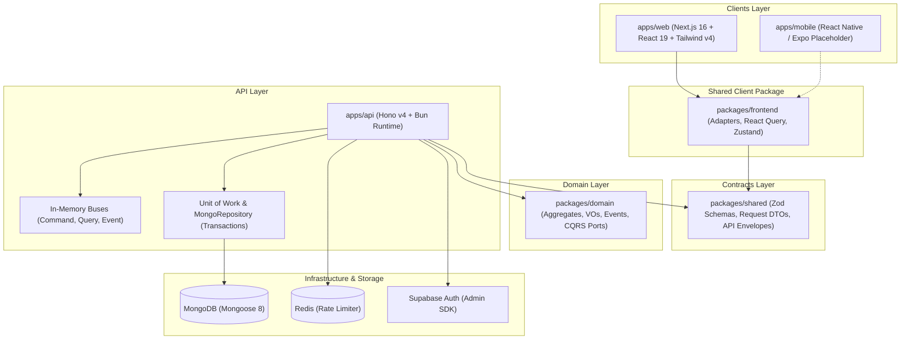

# E-Commerce Monorepo — End-to-End System Documentation

An enterprise-grade, multi-platform e-commerce solution built with **Domain-Driven Design (DDD)**, **Clean Architecture / Hexagonal Architecture**, and **Command-Query Responsibility Segregation (CQRS)** principles.

> 📖 **Full Engineering & Architecture Guide**: See [**`PROJECT_DOCUMENTATION.md`**](file:///home/abdul-ahad/Desktop/hono_backend/PROJECT_DOCUMENTATION.md) for the complete 750-line manual including DDD analogies, the 4-layer restaurant model, the Aggregate Fortress pattern, all 4 cross-module decoupling patterns (QueryBus, CommandBus, EventBus, ACL), race-condition prevention, and the developer cheatsheet.

---

## 🏗️ Architecture Overview



---

## 📦 Workspace Layout

| Workspace | Description | Tech Stack |
| :--- | :--- | :--- |
| [`apps/api`](file:///home/abdul-ahad/Desktop/hono_backend/apps/api) | High-performance modular backend API | **Hono v4**, **Bun**, **MongoDB** (Mongoose 8), **Redis**, **Supabase Auth** |
| [`apps/web`](file:///home/abdul-ahad/Desktop/hono_backend/apps/web) | Customer storefront, account portal & admin backoffice | **Next.js 16**, **React 19**, **Tailwind CSS v4**, **HeroUI v3**, **Zustand** |
| [`apps/mobile`](file:///home/abdul-ahad/Desktop/hono_backend/apps/mobile) | Native mobile app placeholder | **React Native / Expo** |
| [`packages/domain`](file:///home/abdul-ahad/Desktop/hono_backend/packages/domain) | Pure domain logic: Aggregates, Value Objects, Domain Events, CQRS | **TypeScript** (Zero runtime dependencies) |
| [`packages/shared`](file:///home/abdul-ahad/Desktop/hono_backend/packages/shared) | Data contracts, Zod schemas, Request DTOs, API models | **Zod**, **TypeScript** |
| [`packages/frontend`](file:///home/abdul-ahad/Desktop/hono_backend/packages/frontend) | Cross-platform headless client SDK (Adapters, React Query, Zustand) | **TanStack Query 5**, **Zustand 5**, **Supabase Client** |

---

## 🛡️ Core Domain Architecture (`packages/domain`)

- **Aggregates**:
  - `UserAggregate`: Strict moderation invariants (block, ban with duration extension/reduction, soft-delete, role assignment).
  - `ProductAggregate`: Multi-image gallery, ingredients, disclaimers, price aggregation, and appearance status.
  - `ProductVariantAggregate`: SKU-level specifications, color, size, pricing, and availability.
  - `InventoryAggregate`: Atomic stock reservations, stock replenishment, low-stock threshold management.
  - `OrderAggregate`: Multi-vendor checkout, idempotency key checks, address snapshots, and event generation.
  - `VendorAggregate`: Vendor profiles, KYC approval/rejection workflows, and owner verification.
  - `CategoryAggregate`: Hierarchical category cataloging.
  - `AddressAggregate`: Customer delivery addresses and default toggles.
  - `HomeAggregate`: CMS layout engine (hero slides, promo banners, categories, product shelves).
- **Value Objects (31+)**: Self-validating immutable types (`Id`, `Money`, `Quantity`, `DateVO`, `EffectiveDate`, `ExpirationDate`, `EmailVO`, `BanInfoVO`, `BlockInfoVO`, `DeleteInfoVO`, `FullAddressVO`, `AppearanceVO`, `ColorVO`, `Title`, `Description`, `Slug`, etc.).
- **CQRS**: In-memory Command Bus, Query Bus, and Event Bus decoupling operations across modules.

---

## 🔒 Security & Defensive Middleware (`apps/api`)

- **Request Guards**: Strict payload boundaries defending against CPU exhaustion and buffer exploits (max URL length: 200 chars, max query length: 100 chars, max param length: 20 chars, max body: 1,000 bytes, max JSON depth: 5, max JSON nodes: 50).
- **Rate Limiting**: Distributed sliding Token Bucket algorithm backed by Redis (10 token burst capacity, 1 token/sec refill).
- **Authentication**: JWT verification via Supabase Server Admin API with real-time MongoDB user state checks (blocks/bans/deletions).
- **Unit of Work & Transactions**: `AsyncLocalStorage` transaction context propagating MongoDB sessions across repositories with transient error retries.

---

## 🌐 Web Application (`apps/web`)

- **Client Storefront** (`/client/home`, `/client/product/[id]`): Hero banner, categories, product catalog grid, responsive layout.
- **Account Management** (`/account/profile`, `/account/address`): Profile stats, danger zone, address creation/update modal, default address switcher.
- **Admin Portal** (`/admin/home`): Drag-and-drop homepage CMS management for slides, promos, and product containers.
- **Shared Client SDK**: Cross-platform auth and storage adapters (`.web.ts` and `.native.ts`) allowing code reuse across Web and Mobile.

---

## 🚀 Getting Started

### Prerequisites
- [Bun](https://bun.sh/) (v1.4+)
- MongoDB running (Replica Set recommended for transactions)
- Redis server running
- Supabase project credentials

### Installation & Execution

```bash
# Install all dependencies across workspaces
bun install

# Run backend (port 8000) and web (port 3000) concurrently
bun run dev

# Run type checks across all workspaces
bun run typecheck

# Run test suite
bun run test

# Check workspace import boundary rules
bun run lint:imports

# Lint & format code
bun run lint
bun run format
```

### Production PM2 Deployment
```bash
pm2 start ecosystem.config.js
```